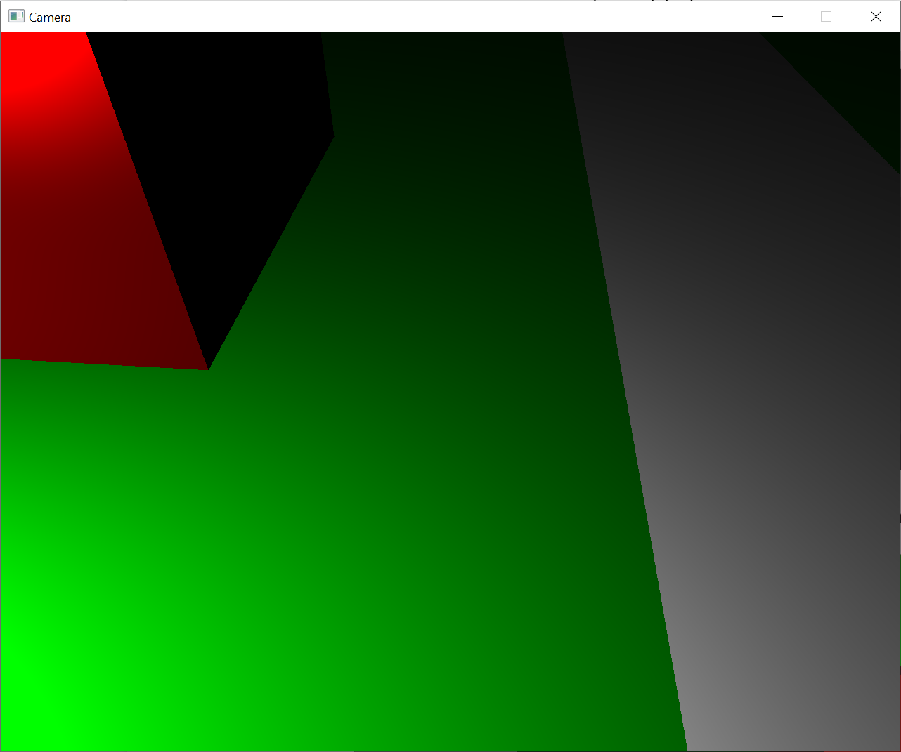

# GL Phong Camera

Implementacja wirtualnej kamery i modelu odbicia Phonga.

Scena składa się prostokątów imitujących trawnik i przebiegającą przez niego drogę, prostopadłościanów imitujących dwa wielopiętrowe wieżowce i większy budynek z dobrze odbijającym oknem i z zawieszonej w powietrzu kuli.

W miejscu źródła światła znajduje się mała, biała kula imitująca żarówkę. Położeniem źródła światła i parametremi charakteryzującym właściwość połysku zawieszonej kuli można sterować.

Całość została zaimplementowana w języku C++ i korzysta z OpenGL.

## Instrukcja obsługi
### Sterowanie kamerą:
- w, s, a, d - podejście do przodu, do tyłu, przesunięcie w lewo, prawo z uwzględnieniem obecnego obrotu kamery.
- spacja - przesunięcie pionowo do góry.
- ruch myszy - obrót kamery.
- q, e - zmiana ogniskowej kamery (zoom).

### Sterowanie źródłem światła:
- i, k, j, l - przesunięcie do przodu, do tyłu, w lewo, prawo.
- u, o - przesunięcie pionowo w dół i do góry.

Sterowanie źródłem światła nieuwzględnienia obecnego obrotu kamery.

### Sterowanie modelem Phonga:
- n, m - zmniejszanie i zwiększanie parametru charakteryzującego właściwość połysku
zawieszonej kuli.
- z, x - zmniejszanie i zwiększanie współczynników odbicia tła i rozproszonego dla
całego projektu.
- 1, 2 - przełączanie pomiędzy standardowym modelem Phonga (1) a modelem
Blinna-Phonga (2).

## Wirtualna Kamera
Kamera jest reprezentowana za pomocą pozycji obrotu zdefiniowanej przez kwaternion, na podstawie którego budowana jest macierz transformacji. Dzięki takiemu podejściu jesteśmy w stanie zapobiec zjawisku tzw. blokady przegubu (z ang. gimbal lock), który by występował, gdybyśmy pracowali na samych macierzach.

Zoom został zaimplementowany za pomocą modyfikacji tzw. Field of View (FOV), czyli kąta między płaszczyznami przechodzącymi przez pozycję kamery na górze i na dole ekranu. Prostopadłościany są rysowane za pomocą trójkątów, które są następnie wypełniane kolorem.

### Przykłady działania programu:
Wyświetlanie sceny:

Swobodna możliwość poruszania się i obracania kamery:

Swobodna możliwość poruszania źródłem światła:

Możliwość manipulacji ogniskową kamery (zoom):

## Model odbicia Phonga
Najpierw, dla każdego wierzchołka wyznaczam wektor normalny i przekazuje do go do fragment shadera. Przekazuje też informacje o położeniu źródła światła i kamery, parametr charakteryzujący właściwość połysku powierzchni, współczynniki odbicia tła i rozproszonego i zdefiniowany przeze mnie bazowy kolor obiektu.

Na podstawie tych parametrów, korzystając z modelu odbicia Phonga wyliczam wartość natężenia światła, którą następnie wymnażam przez bazowy kolor obiektu i poddaje korekcji gamma.

W modelu odbicia Phonga ostateczne natężenie światła składa się z sumy natężeń światła odbijanego zwierciadlanie (specular), światła rozproszonego (diffuse) i światła otoczenia (ambient), wymnożonych przez odpowiadające im współczynniki. Aby lepiej zrozumieć i przedstawić zależności pomiędzy tymi wartościami zaimplementowałem mechanizm sterowania współczynnikami w trakcie działania programu.

Zaimplementowałem także możliwość przełączania w trakcie działania programu pomiędzy tradycyjną implementacją modelu Phonga, a odrobinę zmodyfikowaną implementacją nazywaną modelem Blinna-Phonga, która potrafi poprawić właściwości odbić zwierciadlanych w pewnych warunkach - w szczególności gdy właściwość połysku powierzchni jest niska, co daje duży (szeroki) obszar lustrzany. W takiej sytuacji, na krawędziach obszar odbicia lustrzanego może być natychmiast ucięty, ponieważ iloczyn skalarny pomiędzy wektorem patrzenia a wektorem odbicia jest ujemny. Model Blinna-Phonga rozwiązuje ten problem korzystając z tzw. wektora połowicznego. Poniżej zamieszczam przykłady porównujące oba modele na przykładzie mojego programu.

### Przykłady działania programu:
Odbicie od obiektów imitujących budynek i szybę:

To samo odbicie przy wyzerowanym współczynniku odbicia rozproszonego:

Odbicie przy wyzerowanym współczynniku odbicia tła i rozproszonego.

Odbicie od budynków o stosunkowo niskim współczynniku połysku i od trawniku i drodze o bardzo niskich współczynniku połysku:

Odbicie od tych samych obiektów przy wyżej położonym źródle światła:

Odbicie od kuli o niskim współczynniku połysku:

Odbicie od kuli o średnim współczynniku połysku:

Odbicie od kuli o bardzo wysokim współczynniku połysku:

Standardowy model Phonga - obszar odbicia lustrzanego jest natychmiast ucięty na krawędziach:

Model Blinna-Phonga - poprawione właściwości odbicia w identycznych warunkach jak powyżej:

Wyłącznie światło otoczenia:

Wyłącznie światło rozproszone:

Wyłącznie światło odbicia zwierciadlanego:

Światło otoczenia + światło rozproszone + światło odbicia zwierciadlanego (Phong):

